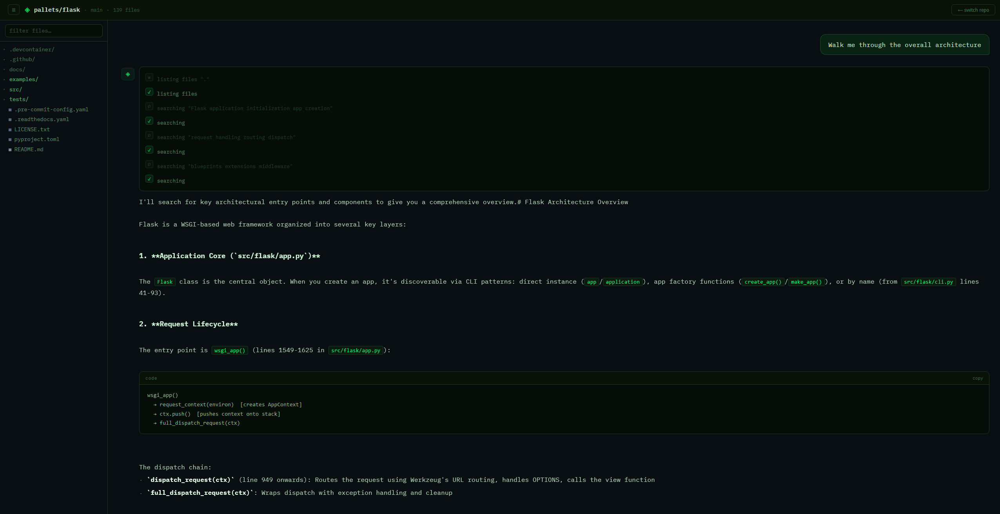
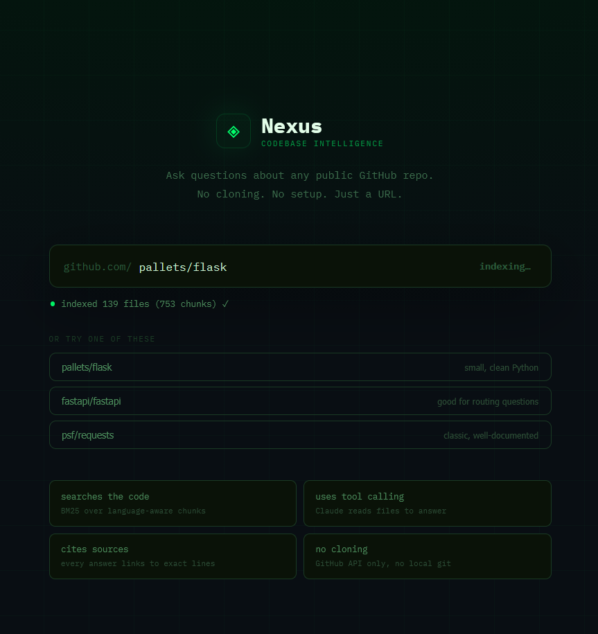

# Nexus

I kept wanting to ask basic questions about codebases I was working in, not "write code for me", just things like *"where does the request for this endpoint actually get handled"* or *"what does this function do in the context of everything else"*. Paid tools do this but they're expensive and I wanted something I could point at any public repo, not just my own projects.

So I built Nexus. Give it a GitHub URL, it fetches and indexes the code, then you get a chat interface backed by a Claude agent that actually searches and reads the relevant files before answering. The source citations show you exactly what it looked at, and you can click them to view the file with the referenced lines highlighted.



---

## What it actually does

1. **Indexes the repo**: fetches the file tree via the GitHub API (no cloning), filters to source files, and splits them into chunks at function/class boundaries. Language-aware, so a Python file gets split at `def`/`class` and a Go file at `func`.

2. **Searches with BM25**: when you ask a question, the backend does a BM25 retrieval pass over ~10k chunks (for a medium-sized repo) to find candidates. This works better than dense embeddings for code because identifiers are mostly exact-match signals, `getUserById` indexed as `get user by id` matches a query about "get user" without any semantic magic.

3. **Agent with tool use**: Claude gets the search results plus four tools it can call: `search_codebase`, `read_file`, `list_files`, and `generate_docs`. It runs until it has enough context to answer properly, which usually means 2-4 tool calls. You can see these happening in real time.

4. **Streams the response**: text arrives character by character from the API, not faked word-by-word. The tool activity log updates as each tool call starts and completes.

---

## Getting started

You need an Anthropic API key. A GitHub token is optional but bumps the rate limit from 60 to 5000 requests/hour, worth setting up if you're going to use this a lot.

### With Docker (easier)

```bash
git clone https://github.com/Oisin33/Nexus
cd nexus
cp .env.example .env
# Add your ANTHROPIC_API_KEY to .env
docker compose up --build
```

Open **http://localhost:3002**. Takes about 30 seconds to build on first run.

### Without Docker

```bash
# Backend
cd backend
python -m venv venv
source venv/bin/activate
pip install -r requirements.txt
export ANTHROPIC_API_KEY=sk-ant-...
uvicorn app:app --reload --port 8000

# Frontend (separate terminal)
cd frontend
npm install
npm run dev   # → http://localhost:3002
```

---

## Usage

Paste a GitHub URL into the setup screen and hit index. It'll take 5-30 seconds depending on repo size, it's fetching files one at a time via the GitHub Contents API.



Good repos to try if you want to see it work well:
- `https://github.com/pallets/flask`, small, clean Python, great for structural questions
- `https://github.com/fastapi/fastapi`, good for understanding dependency injection and routing
- `https://github.com/psf/requests`, well-documented, good for tracing request lifecycle

Questions it handles well:
- *"Walk me through the request lifecycle"*
- *"How does authentication work?"*
- *"What would break if I changed the User model?"*
- *"Generate docs for src/api/middleware.py"*

Questions it handles poorly:
- Anything requiring runtime context (what does this return for *this specific input*)
- Very large monorepos where the relevant code is spread across hundreds of files
- Repos where most of the logic is in config files or SQL migrations

---

## Architecture notes

**Why BM25 over embeddings?**

Tried both. BM25 is faster (no model inference), cheaper (no embedding API calls), and about as accurate for code retrieval. The intuition is that code queries are mostly identifier lookups, you search "user authentication" and you want files with `user_auth`, `authenticate_user`, `UserAuthMiddleware` in them. BM25 with a camelCase-aware tokeniser handles this fine. Dense embeddings add value when you're doing conceptual queries ("how is state managed") but Claude handles that abstraction layer anyway.

**Why FastAPI over Flask?**

The SSE streaming. Flask's streaming support works but FastAPI's async `StreamingResponse` is much cleaner to use, and `uvicorn` handles concurrent requests properly without the threading hacks you need with Flask's dev server.

**The chunking strategy**

Definition-boundary chunking (splitting at `def`, `class`, `func`, etc.) makes each chunk a coherent unit. The alternative, fixed-size windows, produces chunks that start mid-function with no useful signal for the first few lines. It's a meaningful difference in retrieval quality.

---

## Limitations / known issues

- **Single repo, single session**: the index lives in process memory. Restart the backend and you'll need to re-index. Adding SQLite persistence for the BM25 index is the obvious next step but wasn't worth the complexity for local use.
- **Public repos only**: GitHub OAuth for private repos isn't implemented.
- **Large repos are slow to index**: anything with 500+ source files will take a minute because of GitHub API rate limits. Add a `GITHUB_TOKEN` to get 5000 req/hr instead of 60.
- **The file viewer syntax highlighting is basic**: regex-based, handles strings/comments/keywords. It's fine for readability but don't mistake it for a real highlighter.

---

## Project layout

```
nexus/
├── backend/
│   ├── app.py              FastAPI app, thin HTTP layer
│   ├── agent.py            Claude tool-calling loop + SSE streaming
│   ├── indexer.py          Code chunking and BM25 index construction
│   ├── retriever.py        Search and file access over the index
│   └── github_fetcher.py   GitHub REST API client
│
├── frontend/
│   └── src/
│       ├── App.tsx
│       └── components/
│           ├── RepoSetup.tsx       Landing / indexing flow
│           ├── ChatInterface.tsx   Main chat UI (file tree + chat + viewer)
│           ├── FileTree.tsx        Collapsible file explorer sidebar
│           └── FileViewer.tsx      File content viewer with line highlighting
│
├── docker-compose.yml
└── .env.example
```

---

## Keyboard shortcuts

| Shortcut | Action |
|----------|--------|
| `⌘K` | Focus input |
| `⌘\` | Toggle file tree sidebar |
| `Esc` | Close file viewer |
| `Shift+Enter` | Newline in input |

---

## License

MIT
